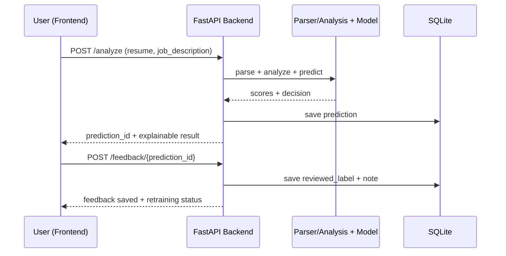

# Adaptive Resume Screener

Adaptive Resume Screener is a full-stack mini-project that compares a resume against a target job description and produces an explainable screening result. The project combines rule-based text analysis with a PyTorch model, stores results in SQLite, and now supports feedback persistence from the website.

This repository is presentation-ready for a 5-student team project. The core flow works end to end:

1. Upload a resume file.
2. Paste a job description.
3. Generate ATS-style, semantic, and blended screening scores.
4. Store the prediction in SQLite.
5. Submit feedback from the UI and store it in the same database for future retraining.

## Problem Statement

Manual resume screening is slow, repetitive, and inconsistent. Recruiters or reviewers often need a quick first-pass filter before doing a deeper manual evaluation.

This project demonstrates how a lightweight AI-assisted screening system can:

- parse resumes from `.txt`, `.pdf`, and `.docx`
- extract interpretable features
- compare candidate content against a job description
- return an explainable shortlist recommendation
- collect user feedback for adaptive improvement

## Tech Stack

- Frontend: HTML, CSS, Vanilla JavaScript
- Backend: FastAPI, Pydantic, Uvicorn
- ML: PyTorch, scikit-learn
- Database: SQLite
- File parsing: `pypdf`, `python-docx`
- Testing: `pytest`, `httpx`
- Containerization: Docker, Docker Compose

## How The System Works

### 1. Resume parsing

The backend accepts `.txt`, `.pdf`, and `.docx` files and extracts readable text.

### 2. Explainable analysis

The analysis service computes:

- matched keywords
- missing keywords
- ATS-style score
- semantic similarity score
- final blended score

### 3. Model features

The PyTorch model uses these 6 numeric features:

| # | Feature | Description |
| --- | --- | --- |
| 1 | `years_experience` | Estimated years of relevant work experience. |
| 2 | `skills_match_score` | Percent-style score for overlap between resume and job skills. |
| 3 | `education_level` | Encoded education tier used by the model pipeline. |
| 4 | `project_count` | Number of relevant projects detected in the resume. |
| 5 | `resume_length` | Approximate resume text length signal. |
| 6 | `github_activity` | Activity proxy derived from portfolio/GitHub mentions. |

#### ResumeNet architecture (simple sketch)

```text
Input (6 features)
   │
   ├─ In-model normalization: (x - mean) / std
   │
   ├─ Linear(6 → 128) + ReLU + BatchNorm1d
   │
   ├─ Linear(128 → 64) + ReLU
   │
   └─ Linear(64 → 1)  →  screening logit
```

### 4. Prediction storage

Every analysis is stored in `database/resume_screening.db` with:

- prediction probability
- shortlist or reject decision
- threshold used
- source of prediction
- explainability data
- review status and feedback note

### 5. Feedback loop

From the website, a user can mark the recommendation as:

- correct
- incorrect

An optional note is also stored. Labeled feedback is later used by the adaptive retraining pipeline in `feedback_loop/`.

## Current Model Snapshot

The saved checkpoint in `ml/models/resume_net.pt` evaluates to:

- Threshold: `0.30`
- Accuracy: `0.6988`
- Precision: `0.6988`
- Recall: `1.0000`
- F1: `0.8227`
- Test size: `6000`

These results are suitable for a college prototype demo. They should not be presented as production hiring quality.

## Project Structure

```text
adaptive-resume-screener/
|-- backend/
|   |-- api/routes.py
|   |-- schemas/prediction.py
|   |-- services/
|   |   |-- model_service.py
|   |   |-- prediction_repository.py
|   |   |-- resume_analysis_service.py
|   |   `-- resume_parser_service.py
|   `-- main.py
|-- frontend/
|   |-- index.html
|   |-- app.js
|   `-- styles.css
|-- database/
|   |-- schema.sql
|   `-- resume_screening.db
|-- ml/
|   |-- inference/
|   |-- models/
|   |-- preprocessing/
|   `-- training/
|-- feedback_loop/
|-- tests/
|-- data/
|-- docker/
|-- sample_resume.txt
`-- docker-compose.yml
```

## Main API Endpoints

The backend currently exposes these routes without an `/api` prefix:

| Method | Endpoint | Purpose | Typical Request Body | Key Response Fields |
| --- | --- | --- | --- | --- |
| `GET` | `/health` | Service/model health snapshot | None | `status`, `model_loaded`, `device`, `threshold`, `model_version` |
| `POST` | `/predict` | Direct prediction from numeric features | JSON (`years_experience`, `skills_match_score`, `education_level`, `project_count`, `resume_length`, `github_activity`) | `probability`, `decision`, `threshold` |
| `POST` | `/analyze` | Resume + JD analysis and blended screening result | Multipart form (`resume` file + `job_description`) | `prediction_id`, `probability`, `decision`, `ats_score`, `semantic_score`, `final_score` |
| `POST` | `/feedback/{prediction_id}` | Save reviewer label and optional note for a prediction | JSON (`reviewed_label`, optional `feedback_note`) | `saved`, `retrain_available`, `labeled_feedback_count`, `minimum_required`, `message` |
| `GET` | `/feedback/retraining-status` | Check if enough labeled feedback exists for retraining | None | `ready`, `labeled_feedback_count`, `minimum_required`, `message` |

### Short request-response flow



## Run Locally

### Backend

```powershell
python -m venv .venv
.venv\Scripts\Activate.ps1
pip install -r requirements.txt
uvicorn backend.main:app --reload --host 127.0.0.1 --port 8000
```

### Frontend

Open `frontend/index.html` in a browser, or serve it using a simple static server. During local demo use, the frontend expects the backend at `http://localhost:8000`.

### Docker

```powershell
Copy-Item .env.example .env
docker compose up --build
```

Open:

- Frontend: `http://localhost:3000`
- API docs: `http://localhost:8000/docs`

## Deploy To Vercel

This repository now includes Vercel-ready FastAPI entrypoints at `app.py` and `main.py`, plus static frontend assets under `public/`, which matches Vercel's current FastAPI deployment layout.

If you connect the repo to Vercel, it should serve:

- the website from `/`
- the FastAPI app from the same domain
- API docs from `/docs`

Important note for storage:

- On Vercel, the app defaults SQLite and adaptive model registry writes to the runtime temp directory.
- That makes feedback persistence and retrained model artifacts temporary across cold starts and redeploys.
- For durable production persistence, set `DB_PATH`, `MODEL_REGISTRY_PATH`, and `MODEL_REGISTRY_DIR` to persistent storage or move to a hosted database.

## Run Tests

```powershell
python -m pytest -q
```

## Recommended Demo Flow

1. Show the problem statement.
2. Open the frontend and upload `sample_resume.txt`.
3. Paste a targeted job description.
4. Run analysis and explain the scores.
5. Show that the prediction was stored in SQLite.
6. Submit feedback from the website.
7. Show that `reviewed_label`, `reviewed_at`, and `feedback_note` are saved in the database.
8. Explain how adaptive retraining would use the collected feedback later.

For presentation help, see:

- `VIVA_QUICK_REFERENCE.md`
- `TEAM_ROLES_AND_RESPONSIBILITIES.md`

## Limitations

- Resume parsing quality depends on the quality of text extraction from PDF and DOCX files.
- Keyword matching and ATS-style scoring are heuristic, not equivalent to a commercial ATS.
- Semantic similarity uses TF-IDF, not transformer embeddings.
- The model is trained on compact engineered features, not full-document embeddings.
- This is a prototype for academic demonstration, not a production hiring system.

## Future Improvements

- Add batch screening and ranking
- Add recruiter login and feedback history
- Replace TF-IDF semantic matching with embeddings
- Add dashboards for analytics and model drift
- Add approval controls before promoting retrained models
