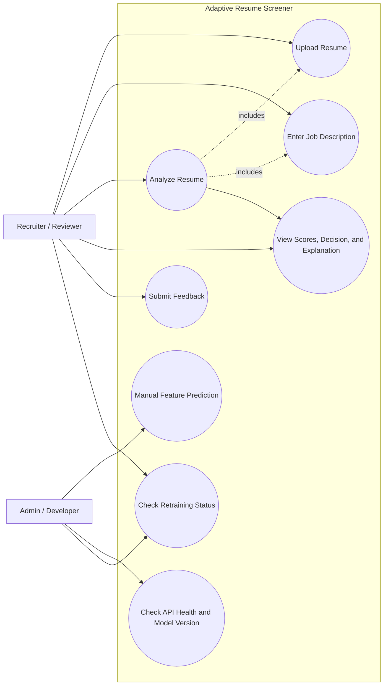
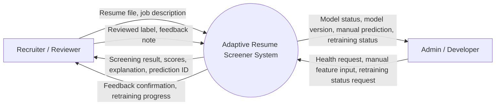
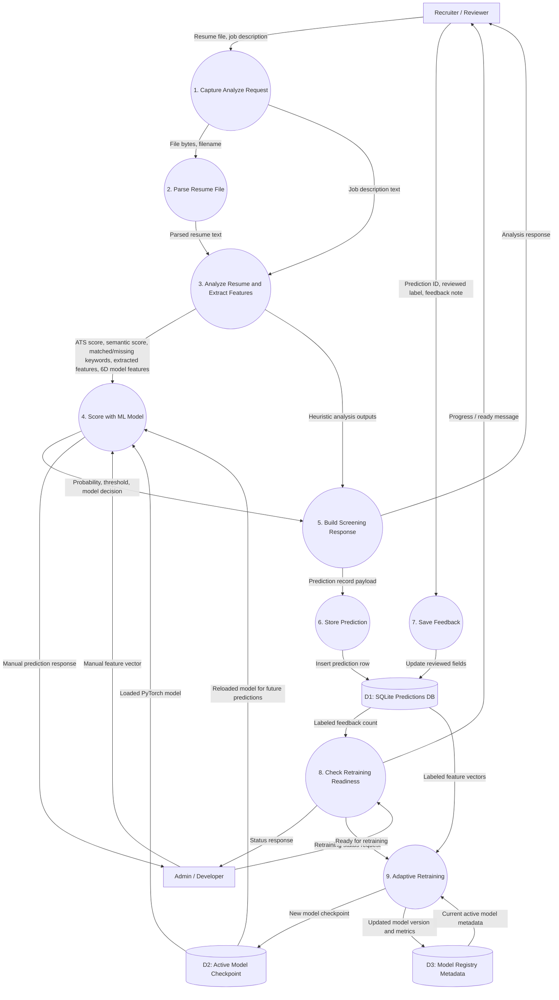
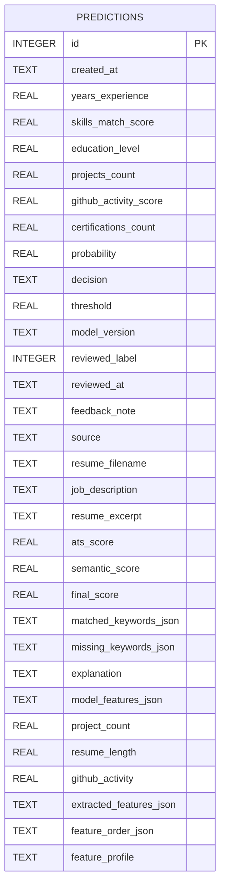
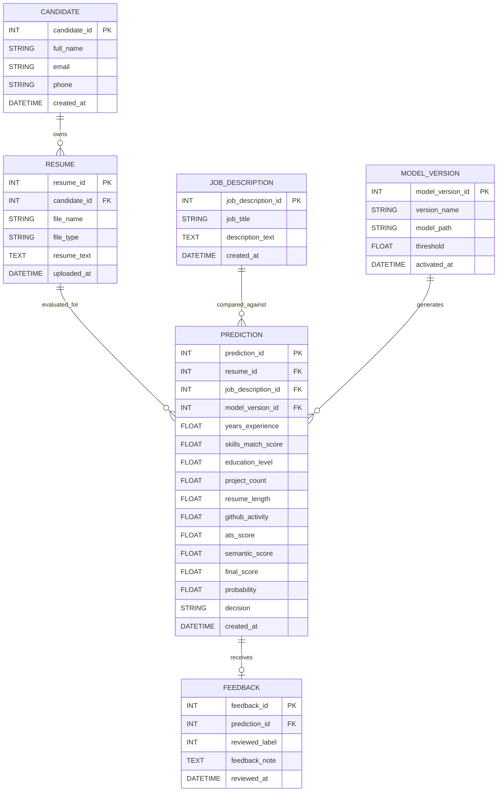
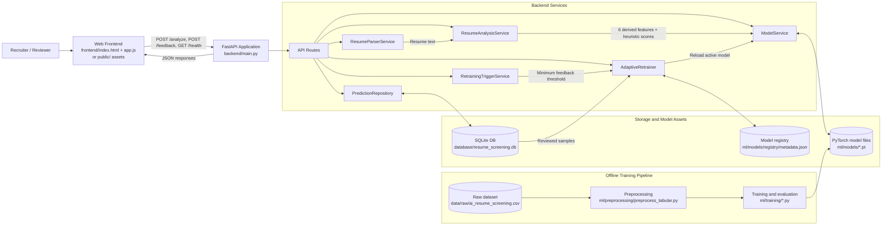

# System Diagrams

These diagrams are based on the current implementation in:

- `backend/main.py`
- `backend/api/routes.py`
- `backend/services/`
- `feedback_loop/`
- `database/schema.sql`
- `frontend/app.js`

## 1. Use Case Diagram

## 2. Data Flow Diagram Level 0

This Level 0 DFD is treated as a context diagram: the whole application is modeled as one process.

## 3. Data Flow Diagram Level 1

This Level 1 DFD expands the internal runtime flow, including the feedback-driven retraining loop.

## 4. Entity-Relationship (ER) Diagram

### 4A. ER Diagram As Implemented

The current relational schema has one core table: `predictions`.
Feedback is stored on the same record rather than in a separate `feedback` table.

### 4B. Normalized Conceptual ER Diagram

Use this version if you need a more textbook database design for a report, viva, or documentation artifact.
This is a conceptual redesign of the domain model, not the current SQLite implementation.

## 5. High-Level System Architecture Block Diagram

## Notes and Assumptions

- The most important runtime flow is `POST /analyze`, because that is what the frontend uses.
- `POST /predict` is included as an admin/developer style manual prediction use case because it accepts direct feature vectors.
- Section 4A is intentionally "as implemented", while Section 4B is a normalized conceptual redesign for academic presentation.
- Adaptive retraining is background-driven after feedback submission when the labeled-feedback threshold is met.
